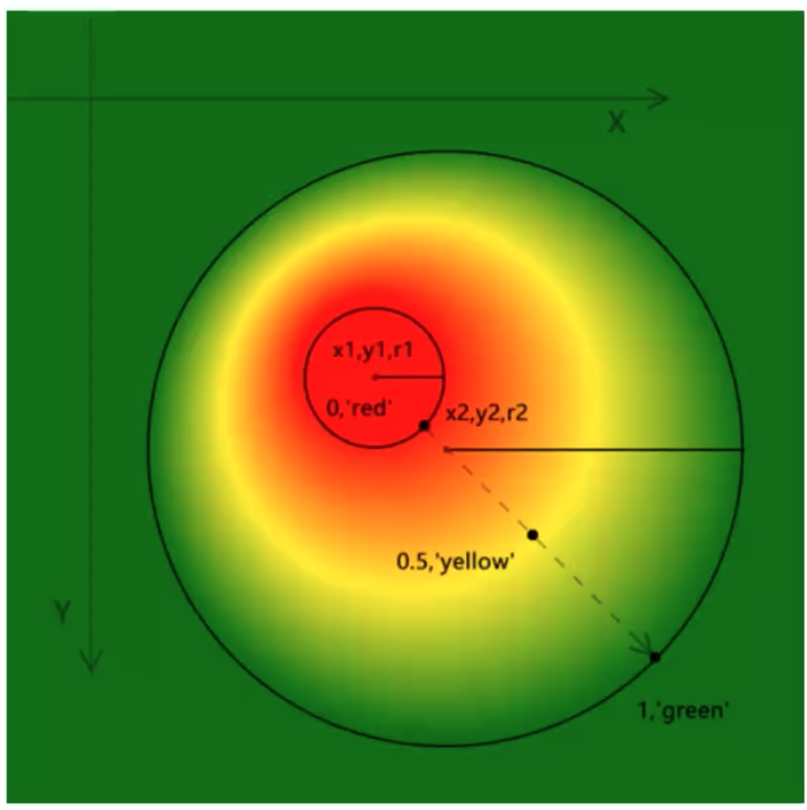
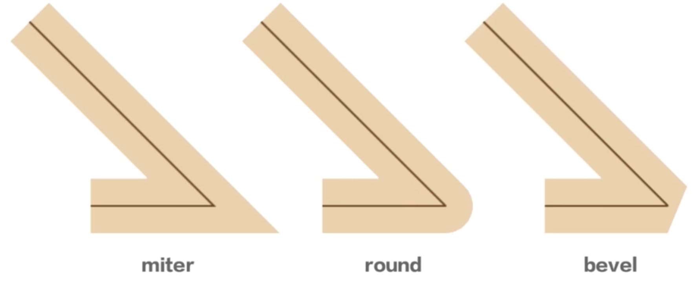
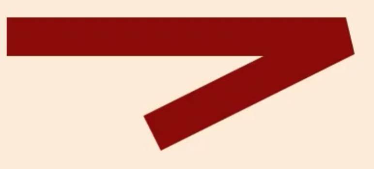

# 1.着色

## 1.1 着色区域

- 描边区域：`strokeStyle`代表描边样式，主要有`stroke()`、`strokeRect()`、`strokeText()`
- 填充区域：`fillStyle`代表填充样式，主要有`fill()`、`fillRect()`、`fillText()`

## 1.2 着色方式

### 1.2.1 纯色

与`css`一致：
- 颜色名称，比如`red`
- 16位的颜色值，比如`#000000`
- `rgb(r, g, b)`
- `rgba(r, b, b, a)`

```js
ctx.fillStyle = "red";
ctx.strokeStyle = "red";
```

### 1.2.2 渐变

#### 1.2.2.1 线性渐变

三个步骤：
1. `ctx.createLinearGradient`创建起终点
2. `addColorStop`设置百分比颜色
3. `ctx.fillStyle`进行赋值

```js
// createLinearGradient(起点x，起点y，终点x，终点y)
const linerGradient = ctx.createLinearGradient(0, 0, 100, 100);

linerGradient.addColorStop(0, "red"); // 0~50% red->yellow过渡
linerGradient.addColorStop(0.5, "yellow"); // 50%～100% yellow->blue过渡
linerGradient.addColorStop(1, "blue");

ctx.fillStyle = linerGradient;
```

#### 1.2.2.2 径向渐变



以不同圆的圆心为位置，然后从一个圆心开始向另一个圆心进行百分比扩散渐变

```js
const radGradient = ctx.createRadialGradient(x0, y0, r0, x1, y1, r1);
radGradient.addColorStop(0, "red");
radGradient.addColorStop(0.5, "yellow");
radGradient.addColorStop(1, "green");
```


#### 1.2.2.3 纹理

使用图像源(`image`、`video`、`canvas`)作为纹理对象，使用该纹理对象作为填充样式

```js
const img = new Image();
img.src = "../../images/1-color.png";
img.onload = ()=> {
    pattern = ctx.createPattern(image, "repeat|repeat-x|repeat-y|no-repeat");

    ctx.fillStyle = pattern;
    ctx.strokeStyle = pattern;
}
```


## 1.3 影响描边样式的因素

- `strokeStyle`：描边颜色
- `lineWidth`: 描边宽度
- `lineCap`: 描边端点样式: `butt`(没有样式)、`round`(圆形)、`square`(矩形样式)
- `lineJoin`: 描边拐角类型: `miter`(尖角)、`round`(圆角)、`bevel`(切角)

- `miterLimit`: 拐角最大厚度（只适用于lineJoin="miter"），可以对尖角进行截断

- `setLineDash`: 将描边设置为虚线，可以通过`getLineDash()`获取虚线样式
- `lineDashOffset`: 虚线偏移一定距离

# 2.投影

```js
ctx.shadowColor = "orange";
ctx.shadowBlur = 50;
```


