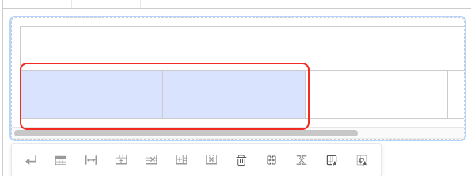
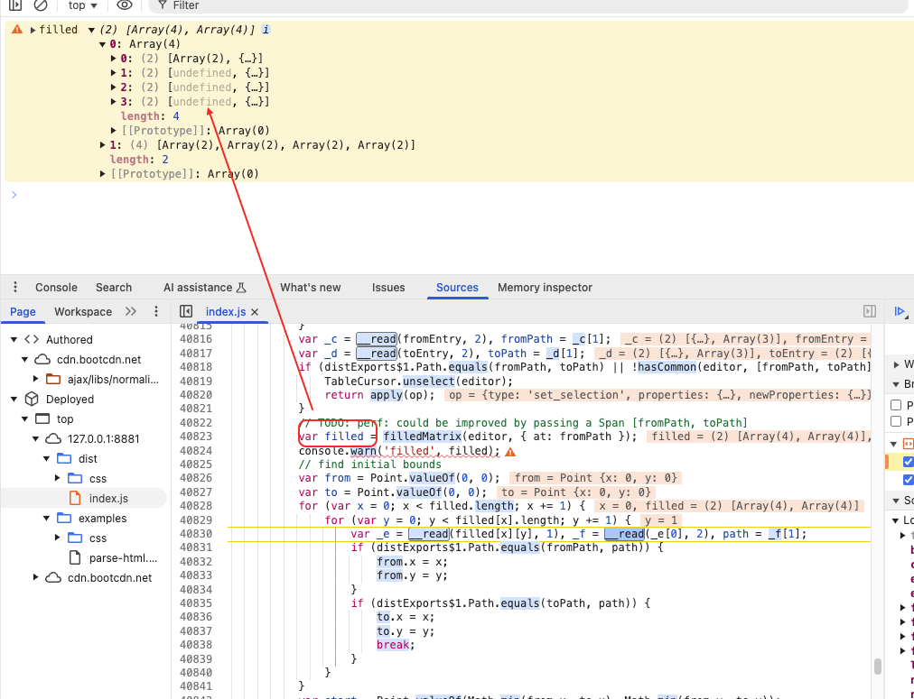
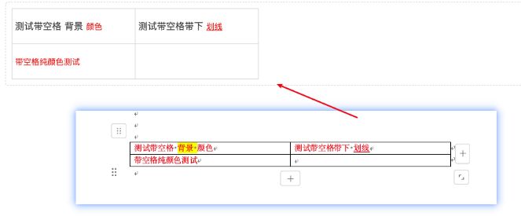
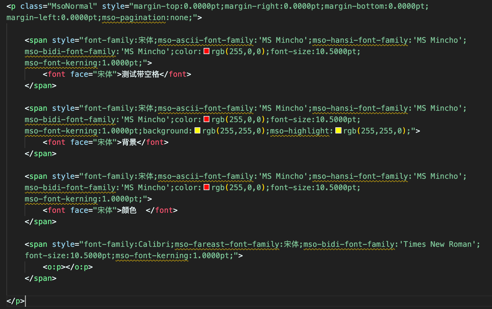
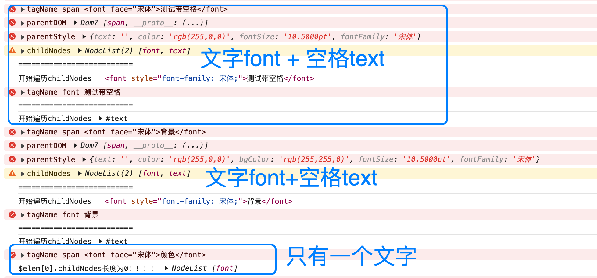
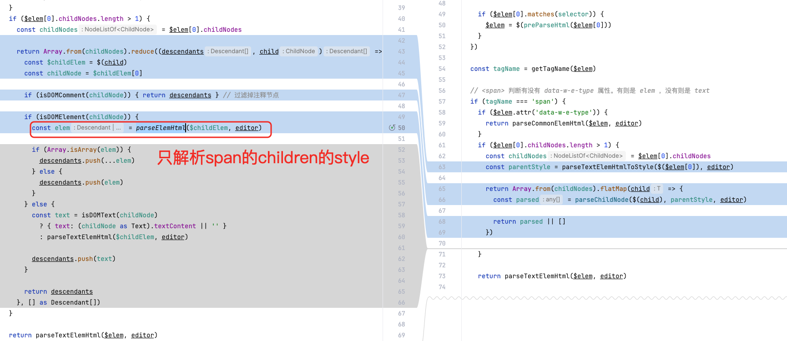
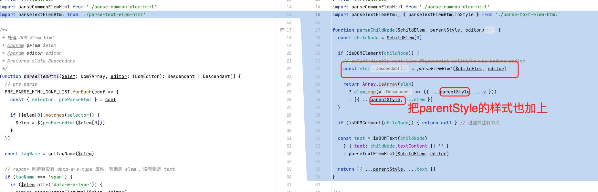

> 思路记录（可能有些杂乱）

# table 表格内的文本元素重构

> 本质跟BlockNote构建 tableBlock 一样，都需要将内联元素构建成为多个 blocks，然后才能进行对某一个 block 水平居中/垂直居中


## 原有的tableModule源码解析

- renderStyle: 传入 node 和 vnode，node 的样式属性 -> vnode 添加样式属性
- styleToHtml: 传入 node 和 DOM，node 样式属性 ->  DOM 的CSS
- parseStyleHTML: 传入 DOM 和 node，DOM 的CSS ->  node 样式属性
- renderElems: 根据 SlateElement 创建 VNode
- elemsToHtml: 根据 SlateElement 创建 DOM
- parseElemsHtml: 根据 DOM 解析为一个自定义 Object
- menus: 多个插件，可以进行 table插入、table删除....
- withTable: 扩展/重写 editor 的基础方法，从而适配 table 模式，比如 `重写 insertBreak - cell 内换行，只换行文本，不拆分 node`

## 涉及相关issues的分析

- issues#338: wps表格插入行，复制到wangEditor，然后操作wangEditor会报错
- issues#334: 表格里加空格会导致空格前面文字的样式丢失

### issues#338 wps表格插入行，复制到wangEditor，然后操作wangEditor会报错
> fix(table): fill in the hidden tableCell

#### 问题分析

如下面所示，有一行 `<tr>` 的 `colspan=4`，它只有一个元素

```html
<table style="width: auto;table-layout: fixed;height: 100">
    <colgroup contentEditable="false">
        <col width=180>
        </col>
        <col width=180>
        </col>
        <col width=180>
        </col>
        <col width=180>
        </col>
    </colgroup>
    <tbody>
        <tr>
            <td colspan="4" rowspan="1" width="auto"
                style="border-width: 1px; border-style: solid; border-color: rgb(204, 204, 204);">
                <p><br></p>
            </td>
        </tr>
        <tr>
            <td colspan="1" rowspan="1" width="auto"
                style="border-width: 1px; border-style: solid; border-color: rgb(204, 204, 204);">
                <p><span style="font-size: 12pt; font-family: 宋体;"> </span></p>
            </td>
            <td colspan="1" rowspan="1" width="auto"
                style="border-width: 1px; border-style: solid; border-color: rgb(204, 204, 204);">
                <p><span style="font-size: 12pt; font-family: 宋体;"> </span></p>
            </td>
            <td colspan="1" rowspan="1" width="auto"
                style="border-width: 1px; border-style: solid; border-color: rgb(204, 204, 204);">
                <p><span style="font-size: 12pt; font-family: 宋体;"> </span></p>
            </td>
            <td colspan="1" rowspan="1" width="auto"
                style="border-width: 1px; border-style: solid; border-color: rgb(204, 204, 204);">
                <p><br></p>
            </td>
        </tr>
    </tbody>
</table>
```

最终 `parseRowHtml()` 生成的 children 也只有一个元素
```ts
function parseRowHtml(
  _elem: DOMElement,
  children: Descendant[],
  _editor: IDomEditor,
): TableRowElement {

  return {
    type: 'table-row',
    // @ts-ignore
    children: children.filter(child => DomEditor.getNodeType(child) === 'table-cell'),
  }
}
```

在 `setSelection()` 选中两个单元格的过程中


触发了 `filledMatrix()` 构建出一个数组，其中由于只生成了一个元素，导致部分数据为 undefined ， 如下图所示



在遍历 `const [[, path]] = filled[x][y]` 时直接报错，导致异常情况的发生
```ts
export function withSelection<T extends Editor>(editor: T) {  
    editor.apply = (op: Operation): void => {  
      const filled = filledMatrix(editor, { at: fromPath })
      //...
      for (let x = 0; x < filled.length; x += 1) {
        for (let y = 0; y < filled[x].length; y += 1) {
          const [[, path]] = filled[x][y]
  
          if (Path.equals(fromPath, path)) {
            from.x = x
            from.y = y
          }
  
          if (Path.equals(toPath, path)) {
            to.x = x
            to.y = y
            break
          }
        }
      }
      //...
    }
  
    return editor
  }
```

> 问题来了？我可以直接判断为空就 continue 吗？

#### 解决方法

如果 colSpan > 1，检查是否需要构建出足够的 `table-cell`，即 `colSpan` 有多少，就构建出多少个 `tableCell`

```ts
function parseRowHtml(
  _elem: DOMElement,
  children: Descendant[],
  _editor: IDomEditor,
): TableRowElement {
    const tableCellChildren: TableCellElement[] = []
    for (let i = 0; i < children.length; i += 1) {
      const child = children[i]
      // 确保是 table-cell 类型
      if (DomEditor.getNodeType(child) === 'table-cell') {
        const tableCell = child as TableCellElement
        const colSpan = tableCell.colSpan || 1
        tableCellChildren.push(tableCell) // 先添加当前单元格
        // 如果 colSpan > 1，检查是否存在足够的隐藏 table-cell
        for (let j = 1; j < colSpan; j += 1) {
          const nextChild = children[i + j]
          if (
            nextChild
            && DomEditor.getNodeType(nextChild) === 'table-cell'
            && (nextChild as TableCellElement).hidden
          ) {
            // 已有隐藏的 table-cell，无需补充
            continue
          } else {
            // 补齐缺少的隐藏 table-cell
            tableCellChildren.push({
              type: 'table-cell',
              children: [{ text: '' }],
              hidden: true,
            })
          }
        }
      }
    }
    
    return {
      type: 'table-row',
      children: tableCellChildren,
    }
}
```


### issues#334 表格里加空格会导致空格前面文字的样式丢失
> fix(table): compatible with table style nesting


#### 问题分析

WPS 有一个 TableCell，里面 "A B"，都是红色的文字，复制整个 Table 到 wangEditor 后，会发现，只有 B 这个文字是红色的，A前面的文字颜色丢失



#### 解决方法

如下面所示，`<p>`可以解析出来多个子元素



其中会分解为3个元素
- `[font, text]`: font 为`测试带空格` + text 为`(后面的空格，为" ")`
- `[font, text]`: font 为`背景` + text 为`(后面的空格，为" ")`
- `[font]`: font 为`颜色`




当遇到最后一个元素时，我们由于 children 为空，因此我们会直接解析当前元素，拿到正确的 style

但是当我们遇到非最后一个元素时，由于空格的作用，我们会得到两个元素，这个时候我们只会处理所有子元素当作当前元素的 style ，而忽视了 style 其实在 parentDom ，也就是 span 身上

因此在原来的基础上，将 parentStyle 也加到当前元素的 style 上





## 想要实现效果的源码解析


## 改造tableModule

## 单元测试相关改造


### 熟悉目前的单元测试规则

### 增加/完善tableModule的单元测试

