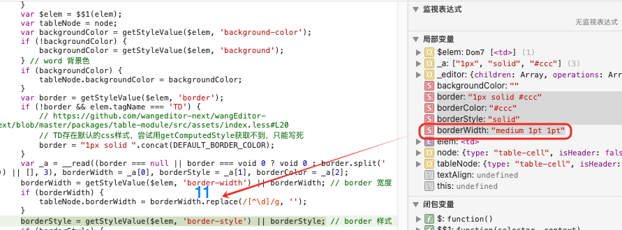

> https://github.com/wangeditor-next/wangEditor-next/issues/146
>
> 记录了解决这个问题的思路

# Bug: Error format when copying table from .docx

这个issues还残留一个没有修复的问题，复制docx到`Safari`浏览器时会导致`border-width`从`1px`突变为`11px`

思路
- 找到处理`paste`的代码逻辑
- 弄懂`paste`过来的数据结构
- 数据结构如何转化为slate的数据结构


## handlePaste()

```ts
function handleOnPaste(e: Event, textarea: TextArea, editor: IDomEditor) {
  EDITOR_TO_CAN_PASTE.set(editor, true) // 标记为：可执行默认粘贴
  const event = e as ClipboardEvent
  const { readOnly } = editor.getConfig()
  if (readOnly) { return }
  if (!hasEditableTarget(editor, event.target)) { return }
  const { customPaste } = editor.getConfig()
  if (customPaste) {
    const res = customPaste(editor, event)
    if (res === false) {
      // 自行实现粘贴，不执行默认粘贴
      EDITOR_TO_CAN_PASTE.set(editor, false) // 标记为：不可执行默认粘贴
      return
    }
  }
  // 如果支持 beforeInput 且不是纯粘贴文本（如 html、图片文件），则使用 beforeInput 来实现
  // 这里只处理：不支持 beforeInput 或者 粘贴纯文本
  if (!IS_SAFARI && HAS_BEFORE_INPUT_SUPPORT && !isPlainTextOnlyPaste(event)) { return }
  event.preventDefault()
  const data = event.clipboardData
  if (data == null) { return }
  editor.insertData(data)
}
```

- 如果是`IS_SAFARI`，则会执行`editor.insertData(data)`
- 如果不是`Safari` + 支持beforeInput + 不是简单的文本paste => 直接使用`beforeInput()`处理

在上面`https://github.com/wangeditor-next/wangEditor-next/issues/146` ， `safari`和其它浏览器执行的就是不同的分支情况，因此表现不一致

## insertData()

最终调用的是`editor.insertData()`

### table-module的insertData是否重写

发现确实重写了`insertData`

```ts
// 重写 insertData - 粘贴文本
newEditor.insertData = (data: DataTransfer) => {
    const tableNode = DomEditor.getSelectedNodeByType(newEditor, 'table')

    if (tableNode == null) {
        insertData(data) // 执行默认的 insertData
        return
    }

    // 获取文本，并插入到 cell
    const text = data.getData('text/plain')

    // 单图或图文 插入
    if (text === '\n' || /]+>/.test(data.getData('text/html'))) {
        insertData(data)
        return
    }

    Editor.insertText(newEditor, text)
}
```

```ts
// packages/core/src/editor/plugins/with-event-data.ts
e.insertData = (data: DataTransfer) => {
    const fragment = data.getData('application/x-slate-fragment')
    // 只有从编辑器中内复制的内容，才会获取 fragment，从其他地方粘贴到编辑器中，不会获取 fragment

    if (fragment) {
        const decoded = decodeURIComponent(window.atob(fragment))
        const parsed = JSON.parse(decoded) as Node[]

        e.insertFragment(parsed)
        return
    }

    const text = data.getData('text/plain')
    const html = data.getData('text/html')
    // const rtf = data.getData('text/rtf')

    if (html) {
        e.dangerouslyInsertHtml(html)
        return
    }
    //...
}
// packages/core/src/editor/plugins/with-max-length.ts
e.dangerouslyInsertHtml = (html: string = '', isRecursive = false) => {
    if (!html) { return }

    const { maxLength } = e.getConfig()

    if (!maxLength) {
      // 无 maxLength
      dangerouslyInsertHtml(html, isRecursive)
      return
    }
    //...
}
// editor/plugins/with-content.ts
e.dangerouslyInsertHtml = (html: string = '', isRecursive = false) => {
    //...
}
```

经过不断调试发现，最终会调用`editor/plugins/with-content.ts`的`dangerouslyInsertHtml()`

然后触发
- parseElemHtml()
- parseCommonElemHtml()
  
```ts
function parseCommonElemHtml($elem: Dom7Array, editor: IDomEditor): Element[] {
  const children = genChildren($elem, editor)

  // parse
  const parser = getParser($elem)
  let parsedRes = parser($elem[0], children, editor)

  if (!Array.isArray(parsedRes)) { parsedRes = [parsedRes] } // 临时处理为数组

  parsedRes.forEach(elem => {
    const isVoid = Editor.isVoid(editor, elem)

    if (!isVoid) {
      // 非 void ，如果没有 children ，则取纯文本
      if (children.length === 0) {
        elem.children = [{ text: $elem.text().replace(/\s+/gm, ' ') }]
      }

      // 处理 style
      PARSE_STYLE_HTML_FN_LIST.forEach(fn => {
        elem = fn($elem[0], elem, editor) as Element
      })
    }
  })

  return parsedRes
}
```


- `genChildren()`解析出对应的children数据也就是`type: "table-row"`的相关数据
- 根据`getParser($elem)`元素类型获取对应的解析，也就是`parser = parseTableHtml(table类型)`，然后触发`parseTableHtml(table, table-row相关数据, editor)`

> 这些方法都是复用的，绕来绕去...最终每一种类型都会调用`parseCommonElemHtml()` => 然后拿到对应的`parse`去解析
> 

在`PARSE_STYLE_HTML_FN_LISTf.forEach()`中处理style => $elem对应的style
> 因此得断点到 $elem = <td>的时候

这里也是多态，最终会调用`packages/table-module/src/module/parse-style-html.ts`的`parseStyleHtml`解析出`border-width`




就是上面截图这个属性最终转化为`11`导致的border-width计算错误！！！!

## 为什么会出现这种border: 1px solid #ccc，但是borderWidth: medium 1pt 1pt的现象？


下面的`e.dangerouslyInsertHtml(html)`就是上面截图中的`border-width: medium 1pt 1pt`，也就是说拿到的数据就是这样奇奇怪怪的格式，可能是进行了什么操作设置border导致的，因为上面一个`<td>`是正常的`border-width`或者`safari浏览器`就是如此（第一行正确，第二行开始就不正确）

```ts
function handleOnPaste(e, textarea, editor) {
    //...
    event.preventDefault();
    var data = event.clipboardData;
    if (data == null) {
        return;
    }
    editor.insertData(data);
}
e.insertData = function (data) {
    var e_1, _a;
    var fragment = data.getData('application/x-slate-fragment');
    // 只有从编辑器中内复制的内容，才会获取 fragment，从其他地方粘贴到编辑器中，不会获取 fragment
    if (fragment) {
        var decoded = decodeURIComponent(window.atob(fragment));
        var parsed = JSON.parse(decoded);
        e.insertFragment(parsed);
        return;
    }
    var text = data.getData('text/plain');
    var html = data.getData('text/html');
    // const rtf = data.getData('text/rtf')
    if (html) {
        e.dangerouslyInsertHtml(html);
        return;
    }
    //...
}
```


## border-width到底有多少种格式？

https://developer.mozilla.org/en-US/docs/Web/CSS/Reference/Properties/border-width


竟然有这么多种格式！！！我去！

```css
/* Keyword values */
border-width: thin;
border-width: medium;
border-width: thick;

/* <length> values */
border-width: 4px;
border-width: 1.2rem;

/* top and bottom | left and right */
border-width: 2px 1.5em;

/* top | left and right | bottom */
border-width: 1px 2em 1.5cm;

/* top | right | bottom | left */
border-width: 1px 2em 0 4rem;

/* Global values */
border-width: inherit;
border-width: initial;
border-width: revert;
border-width: revert-layer;
border-width: unset;
```

## 思考解决方式

1. 直接去除`borderWidth.replace(/[^\d]/g, '')`?看对应的ts定义也是string类型，为什么一定要转为数字呢？
```ts
  borderWidth = getStyleValue($elem, 'border-width') || borderWidth // border 宽度
  if (borderWidth) {
    // tableNode.borderWidth = borderWidth.replace(/[^\d]/g, '')
  }
```


> 1. 梳理整个解析流程
> 2. 找出style的拼接代码，比如border-width="1"，肯定有个地方是进行 "1"->"1px"，然后拼接到border="1px solid xxx"


### 梳理整个解析border-width流程


```ts
e.dangerouslyInsertHtml = function (html, isRecursive) {
    var div = document.createElement('div');
    div.innerHTML = html;
    var domNodes = Array.from(div.childNodes);
    domNodes.forEach(function (n, index) {
    //...
    var parsedRes = parseElemHtml($el, e);
        //...
    });
}
```

```ts
function parseElemHtml($elem, editor) {
    //...
    return parseCommonElemHtml($elem, editor);
}

function parseCommonElemHtml($elem, editor) {
    var children = genChildren($elem, editor);
    // parse
    var parser = getParser$1($elem);
    var parsedRes = parser($elem[0], children, editor);
    if (!Array.isArray(parsedRes)) {
        parsedRes = [parsedRes];
    } // 临时处理为数组
    parsedRes.forEach(function (elem) {
        var isVoid = distExports$1.Editor.isVoid(editor, elem);
        if (!isVoid) {
            // 非 void ，如果没有 children ，则取纯文本
            if (children.length === 0) {
                elem.children = [{ text: $elem.text().replace(/\s+/gm, ' ') }];
            }
            // 处理 style
            PARSE_STYLE_HTML_FN_LIST.forEach(function (fn) {
                elem = fn($elem[0], elem, editor);
            });
        }
    });
    return parsedRes;
}

//...上面的parser()会根据类型调用，table -> tr -> td -> span不停调用这个`parseCommonElemHtml()`
// 最终`<td>`会触发`PARSE_STYLE_HTML_FN_LIST.forEach(...)`调用tableModule的`parseStyleHtml()`，然后解析border-width

function parseStyleHtml(elem: DOMElement, node: Descendant, _editor: IDomEditor): Descendant {
  //...
  borderWidth = getStyleValue($elem, 'border-width') || borderWidth // border 宽度
  if (borderWidth) {
    tableNode.borderWidth = borderWidth.replace(/[^\d]/g, '')
  }
  //...
}
```


```ts

```


### 找出style的拼接代码