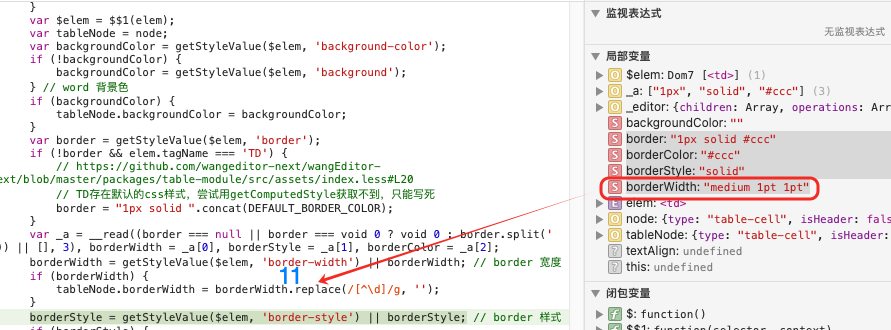

## 问题发生的原因




如上图所示，从`safari`复制过来的数据中出现了`border-width: medium 1pt 1pt`的数据


在`packages/table-module/src/module/parse-style-html.ts`的`parseStyleHtml`解析`border-width`，会将`medium 1pt 1pt`解析为`11`

> tableNode.borderWidth = borderWidth.replace(/[^\d]/g, '')


在`packages/table-module/src/module/render-style.ts`的拼凑style中，会拼凑解析出来的`11` + `px`构建出`border-width: 11px`的错误情况
```ts
export function renderStyle(node: Descendant, vnode: VNode): VNode {
  if (!Element.isElement(node)) { return vnode }

  const {
    backgroundColor, borderWidth, borderStyle, borderColor, textAlign,
  } = node as TableCellElement

  const props: TableCellProperty = {}

  if (backgroundColor) { props.backgroundColor = backgroundColor }
  if (borderWidth) { props.borderWidth = `${borderWidth}px` }
  if (borderStyle) { props.borderStyle = borderStyle === 'none' ? '' : borderStyle }
  if (borderColor) { props.borderColor = borderColor }
  if (textAlign) { props.textAlign = textAlign }

  const styleVnode: VNode = vnode

  if (node.type === 'table') {
    addVnodeStyle((styleVnode.children?.[0] as VNode).children?.[0] as VNode, props)
  } else {
    addVnodeStyle(styleVnode, props)
  }
  return styleVnode
}
```


## 解决方法

> https://developer.mozilla.org/en-US/docs/Web/CSS/Reference/Properties/border-width
```css
/* Keyword values */
border-width: thin;
border-width: medium;
border-width: thick;

/* <length> values */
border-width: 4px;
border-width: 1.2rem;

/* top and bottom | left and right */
border-width: 2px 1.5em;

/* top | left and right | bottom */
border-width: 1px 2em 1.5cm;

/* top | right | bottom | left */
border-width: 1px 2em 0 4rem;

/* Global values */
border-width: inherit;
border-width: initial;
border-width: revert;
border-width: revert-layer;
border-width: unset;
```

由于`border-width`有多种格式，因此采取的方式是
- 继续保留优先级的解析：`border-width`/`border-color`/`border-style` > `border`缩写
- 保留`border-width`中的格式
  - 如果是`pt`，则按照`1pt = 4/3 px`的逻辑转化
  - 如果是非`pt`的数据，则保留原来的样式，包括`1px`、`1.5em`、`medium`等等


> 参考`https://developer.mozilla.org/zh-CN/docs/Learn_web_development/Core/Styling_basics/Values_and_units` 将`pt`转化为`px`


## 测试用例

按照
```text
由于`border-width`有多种格式，因此采取的方式是
- 继续保留优先级的解析：`border-width`/`border-color`/`border-style` > `border`缩写
- 保留`border-width`中的格式
  - 如果是`pt`，则按照`1pt = 4/3 px`的逻辑转化
  - 如果是非`pt`的数据，则保留原来的样式，包括`1px`、`1.5em`、`medium`等等
```
增加多种样式的解析


## example测试


上图是从safari复制拿到的数据，下面是修正代码后拿到的样式数据

