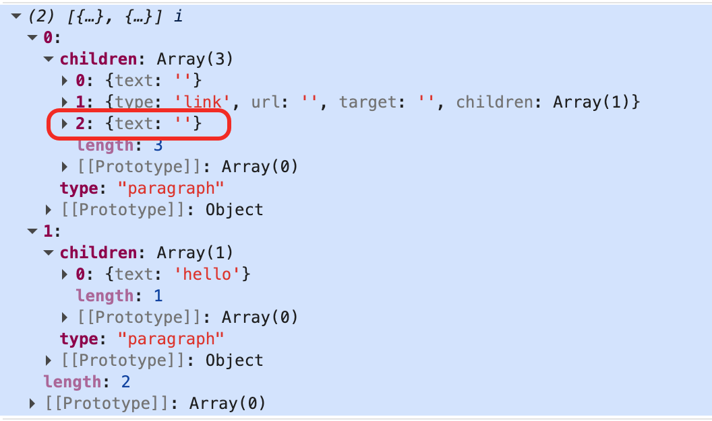
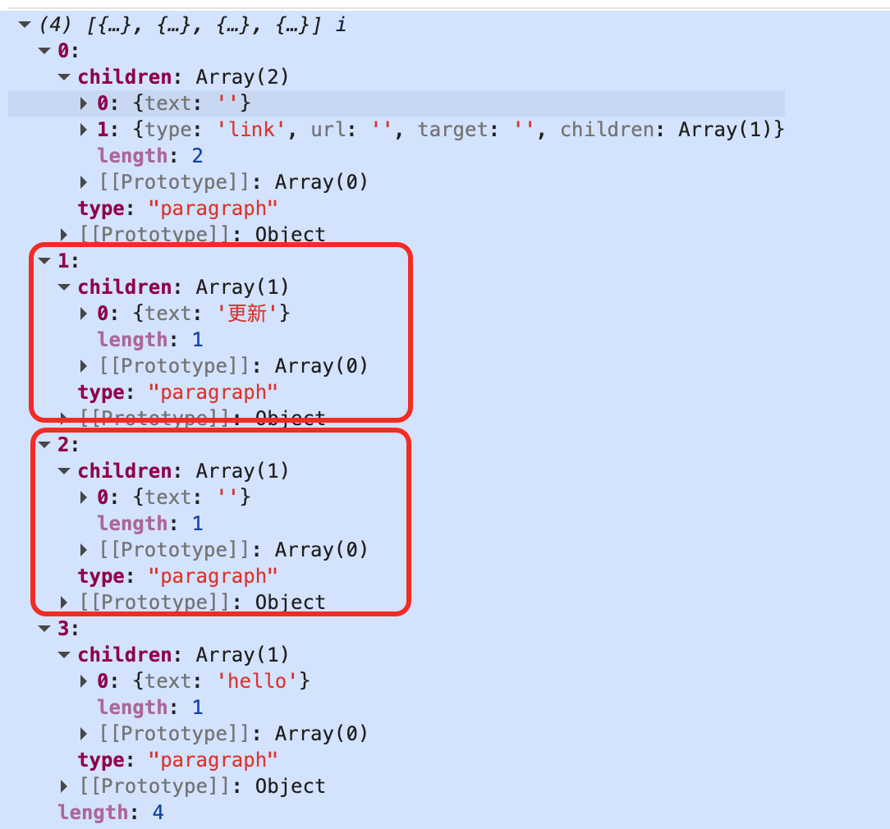
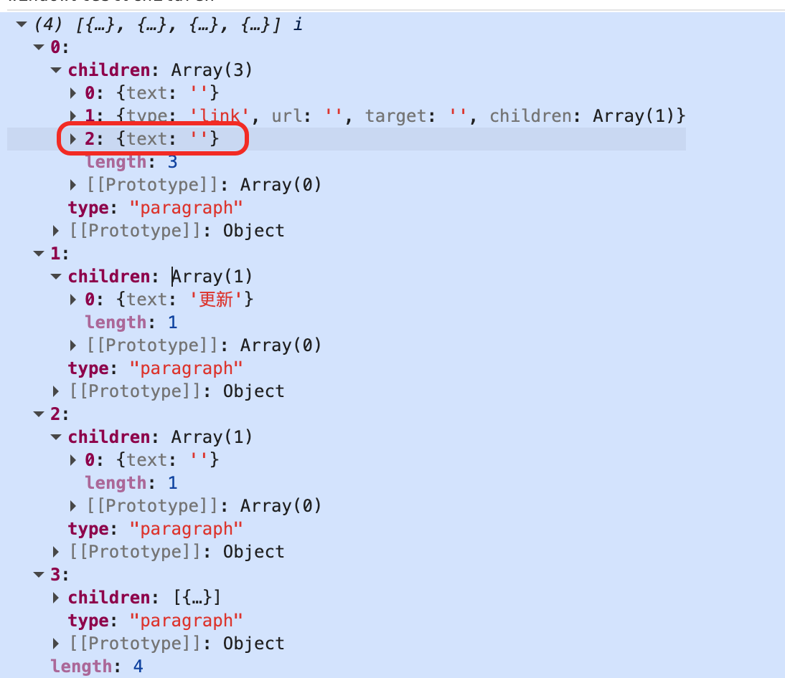
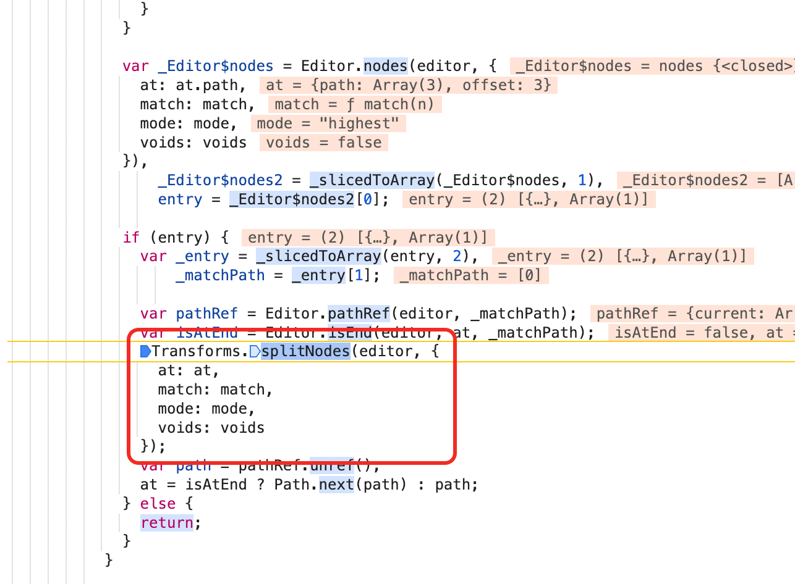

> https://github.com/wangeditor-next/wangEditor-next/issues/541
>
> 记录了解决这个问题的思路

# Bug: 设置dangerouslyInsertHtml底部会多出空白行

```ts
window.editor.dangerouslyInsertHtml("<p><a>222</a></p><p>更新</p>")
```
当设置这样的数据时，会导致真实界面的数据渲染为：`<p><a href="" target="">222</a></p><p>更新</p><p><br></p>`，增加一行`<br>`


多次触发`window.editor.dangerouslyInsertHtml("<p><a>222</a></p><p>更新</p>")`都会增加一行`<br>`

比如触发三次后，界面会变为`<p>2222</p><p><a href="" target="">222</a></p><p>更新</p><p><a href="" target="">222</a></p><p>更新</p><p><a href="" target="">222</a></p><p>更新</p><p><br></p><p><br></p><p><br></p>`

> 后面有3个`<p><br></p>`


## 目前发现的关键点

1. 插入`<a>`后会自动在后面增加一个空格（可能是为了区分当前`a`和后续文字，两个元素不会连接在一起，因为用户可能会还编辑`<a>`所携带的文本内容）
2. 正常情况下，`<a>`会插入一个`inline=空格`，但是在`<p><a/></p>`的情况下，后面的空格会另外起了一行，变为`<p><a/></p><p>空格</p>`，从而导致了问题的发生
3. 如果是`<div><a></a></div><p></p>`则表现正常，不会胡乱起一行


## 调试发现的问题

当插入`<p><a href="" target="">222</a></p>`后是正常的，此时的数据为


继续处理`<p>更新</p>`，会发现好像第一个item的第三个元素被硬生生挤下去一样，然后就自己起了一个新的block


然后由于被挤下去一个元素，最终触发又一次在`<a>`标签插入新的空字符的逻辑，最终形成完整的数据，如下图所示


-----------
> 处理`<p>更新</p>`，会发现好像第一个item的第三个元素被硬生生挤下去一样，然后就自己起了一个新的block????

在插入`<p>更新</p>`时，会触发一次`splitNodes`导致`a`标签形成的3个元素拆分为两个`空字符串` + `<link>` 以及 `空字符串`



`dangerouslyInsertHtml("<p><a>222</a></p><p>更新</p>")`

最终插入<p><a>222</a></p>后形成3个元素，但是光标位置是错误的:
```text
at.path = [0,1,0] 表示：

[0]: 第一个 paragraph 节点
[1]: 该 paragraph 的第二个子节点（link 节点）
[0]: link 节点的第一个子节点（text 节点，内容为 "222"）
offset: 3: 在 "222" 的末尾位置
```

导致第二个`<p>更新</p>`插入时会先进行splitNode，将数据从
```js
旧的数据 = [
  {
    "type": "paragraph",
    "children": [
      {"text": ""},
      {"type": "link", "url": "", "target": "", "children": [{"text": "222"}]},
      {"text": ""},
    ]
  },
  {
    "type": "paragraph",
    "children": [{"text": "我是旧的数据"}]
  }
]
// splitNode后的数据
新的数据 = [
    {
        "type": "paragraph",
        "children": [
            {"text": ""},
            {"type": "link", "url": "", "target": "", "children": [{"text": "222"}]},
        ]
    },
    {
        "type": "paragraph",
        "children": [{"text": ""}]
    },
    {
        "type": "paragraph",
        "children": [{"text": "我是旧的数据"}]
    }
]

```

就是光标在空格前面导致了错误splitNode，可以想象一下，如果光标在一个空格前面，你要在这个光标插入一个文本，确实应该先splitNode，然后再insertNode，表现是对的！


所以问题的关键就在于为什么光标位置是错的？？？


## 插入`<p><a href="" target="">222</a></p><p>哈哈</p>`的光标位置为什么是错误的

要是在a标签后面加个空格`dangerouslyInsertHtml("<p><a>222</a> </p><p>哈哈</p>")`，光标就是正常的在末尾了...就不会splitNode了...

应该是自动加的这个空格导致的，可能得看看这个自动加的空格是wangEditor-next加的还是slate加的，如果是slate加的那就是框架本身的bug了！！

```js
normalizeNode: function normalizeNode(entry) {
    //...
    } else if (isLast) {
      var _newChild = {
        text: ''
      };
      Transforms.insertNodes(editor, _newChild, {
        at: path.concat(n + 1),
        voids: true
      });
      n++;
    }
    //...
}
```

调试证明，就算你插入插入`<p><a href="" target="">222</a></p>`，然后打印出光标位置，也是错误的！

简单点说，就是slate这个库有问题！插入a标签后，又增加一个新的空格，但是selection并没有正确更新！

## 能不能在外部修正这个光标选择错误？

```ts
function fixLinkFocusIfError(editor: IDomEditor, elem: Element) {
  if (elem.type === 'paragraph' && elem.children) {
    const children = elem.children as Element[]

    if (children[children.length - 1].type === 'link') {
      const { selection } = editor

      if (!selection || Range.isExpanded(selection)) {
        return
      }

      const { path } = selection.focus
      const currentPath = [...path]
      let currentNode: Node | null = null

      while (currentPath.length > 0) {
        // 检查当前光标是否在 link 内部
        currentNode = Node.get(editor, path)
        const currentNodeType = DomEditor.getNodeType(currentNode)

        if (currentNodeType !== 'link') {
          currentPath.pop() // 向上一级
        } else {
          break
        }
      }
      if (!currentNode) {
        return
      }
      const parentPath = Path.parent(currentPath)
      const parentNode = Node.get(editor, parentPath) as Element

      if (DomEditor.getNodeType(parentNode) === 'paragraph') {
        const lastChildIndex = parentNode.children.length - 1
        const lastChildPath = [...parentPath, lastChildIndex]
        const lastChild = Node.get(editor, lastChildPath)

        if (Text.isText(lastChild) && lastChild.text === '') {
          // 将光标移动到空文本节点后面
          Transforms.select(editor, { path: lastChildPath, offset: 0 })
        }
      }
    }
  }
}
```

