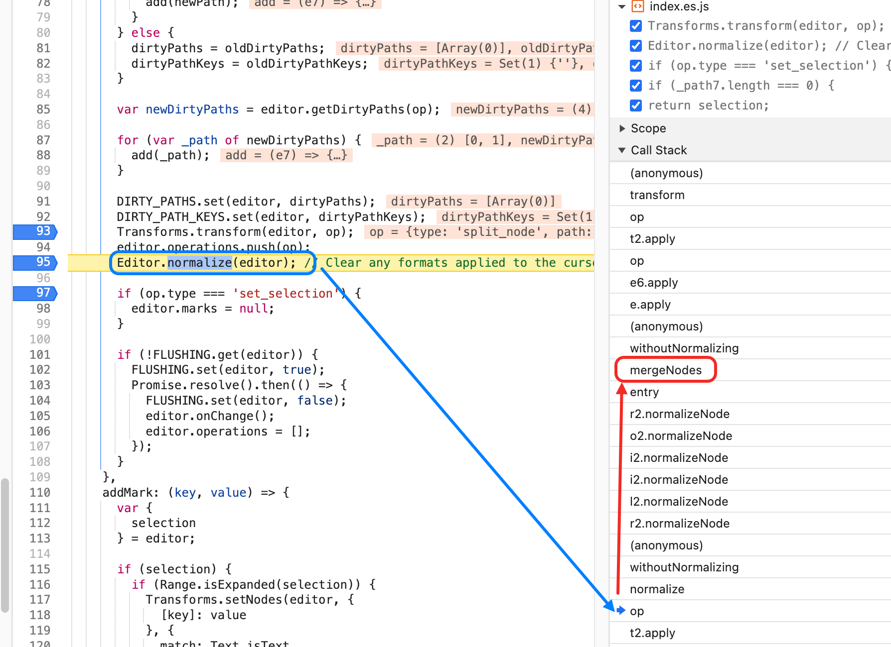

> https://github.com/wangeditor-next/wangEditor-next/issues/724
>
> 记录了解决这个问题的思路

# yjs协作时内容位置会错位到最后面





我发现了，`split_node`已经生效了，并且成功了！

然后会继续执行`Editor.normalize(editor)`，这段代码会执行
```ts
Transforms.mergeNodes(editor, {
    at: path.concat(n),
    voids: true
});
```       

进行两个node节点的合并，最终再次触发一个新的操作：`merge_node`导致刚刚`split_node`的数据又重新合并了


## 很奇怪的点

在`yjs-for-wangEditor-vue3`自己的github项目中，是不会出现这种错位的问题的

但是运行`wangEditor-next`的`examples/frontend-vue3`就会出现这种问题？？？

都是vue3 + vite！！

--------
弄清楚了，如果将`vite.config.ts`中的`alias`去掉，就是下面这行去掉！就能重现！！
```json
"@wangeditor-next/yjs": path.resolve(__dirname, "../src/yjs/src/index.ts"),
```

所以问题出现在`"@wangeditor-next/yjs"`???


## 要弄清楚的点

1. `isNormalizing()`的作用
2. 为什么打包两份slate就会出错？
3. 为什么会打包两份slate？该如何处理这种问题？


## 为什么打包两份slate就会出错？

确实是因为`editor`这个模块打包了`slate` + `yjs`这个模块也需要依赖`slate`

而在`slate`中有一个`WeakMap`的私有变量，虽然传入的`editor`是一样的，但是最终导致了
- 一个`isNormalizing`为true
- 一个`isNormalizing`为false

最终导致操作错误合并！

```ts
  isNormalizing(editor) {
    var isNormalizing = NORMALIZING.get(editor);
    return isNormalizing === undefined ? true : isNormalizing;
  }
```

## 为什么会打包两份slate？该如何处理这种问题？

因为`editor`模块的`package.json`中`dependencies`指明了`"slate": "^0.82.0"`，所以将`slate`打包进去了
```json
"dependencies": {
  ...
  "slate": "^0.82.0",
  ...
}
```

但是`yjs`模块的`package.json`中又声明了
```json
"peerDependencies": {
    "@wangeditor-next/core": "1.7.45",
    "slate": "^0.82.0",
    "yjs": "^13.5.29"
}
```

最终导致了在外部安装了一个`slate`，然后editor这个模块又打包了一个`slate`

---------
解决的方法就是两个`package.json`都声明`peerDependencies`!

然后要求用户在外部引入
```shell
npm install @wangEditor-next/editor
npm install slate
```


## `isNormalizing()`的作用

在`slate`中`normalizing`的作用： `isNormalizing(editor)` 方法会被Slate的核心机制调用来决定是否执行规范化
```js
// Slate内部处理流程
function handleInsertText(editor, text) {
  // 1. 先插入文本
  Transforms.insertText(editor, text);
  
  // 2. 检查是否需要规范化
  if (isNormalizing(editor)) {
    // 3. 执行规范化，清理无效结构
    normalize(editor);
  }
}
```

实际问题解决： 当用户粘贴代码时，可能会产生这样的无效结构
```json
{
  "type": "code_block",
  "children": [
    { "text": "" },  // 空文本节点 - 需要移除
    { "type": "paragraph", "children": [{ "text": "错误的块级元素" }] },  // 代码块内不能包含段落
    { "text": "  正确的代码内容  " }  // 需要清理缩进
  ]
}
```


normalizing会自动修复：
- 移除空的文本节点
- 将paragraph节点转换为普通文本
- 清理多余的缩进和空格
- 确保代码块只包含纯文本内容

------------------------------

性能优化场景：
```js
// 当需要批量插入大量代码行时
Editor.withoutNormalizing(editor, () => {
  // 临时禁用规范化
  for (let i = 0; i < 1000; i++) {
    Editor.insertText(editor, `line ${i}\n`);
  }
  // 只在最后执行一次规范化，而不是每次插入都规范化
});
```
