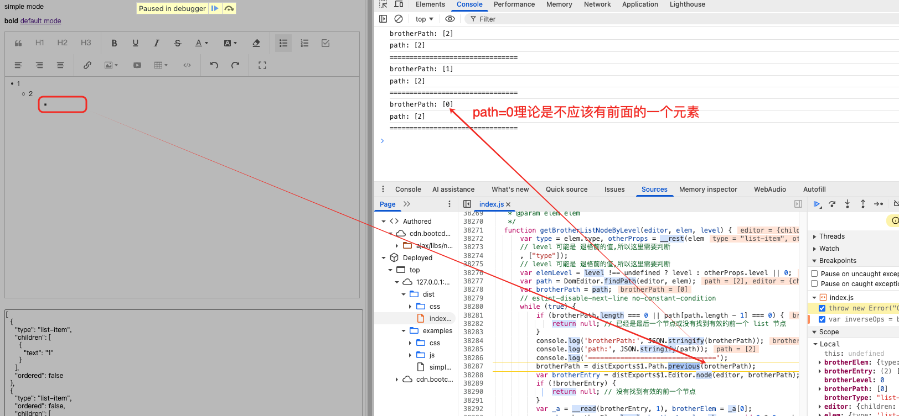

## Related Issues

fix [#655](https://github.com/wangeditor-next/wangEditor-next/issues/655)

## 问题发生的原因

当我们有数据
```text
level1: 1
level2: 2
level4: 
```

当我们想要删除`level4`时，我们会触发`getBrotherListNodeByLevel()`获取上一级的`level3`，因为想要删除的时候将`level4`降级到`level3`

```ts
export function getBrotherListNodeByLevel(
  editor: IDomEditor,
  elem: ListItemElement,
  level?: number,
): ListItemElement | null {
  const { type, ...otherProps } = elem
  // level 可能是 退格前的值,所以这里需要判断
  const elemLevel = level !== undefined ? level : otherProps.level || 0

  const path = DomEditor.findPath(editor, elem)
  let brotherPath = path

  // eslint-disable-next-line no-constant-condition
  while (true) {
    if (brotherPath.length === 0 || path[path.length - 1] === 0) {
      return null // 已经是最后一个节点或没有找到有效的前一个 list 节点
    }
    console.log('brotherPath:', JSON.stringify(brotherPath))
    console.log('path:', JSON.stringify(path))
    console.log('================================')
    brotherPath = Path.previous(brotherPath)
    const brotherEntry = Editor.node(editor, brotherPath)

    if (!brotherEntry) {
      return null // 没有找到有效的前一个节点
    }

    const [brotherElem] = brotherEntry
    const { level: brotherLevel = 0 } = brotherElem as ListItemElement
    const brotherType = DomEditor.getNodeType(brotherElem)

    // 验证兄弟节点是否是期望的类型和层级
    if (brotherType !== type) {
      return null
    }
    if (brotherLevel === elemLevel) {
      return brotherElem as ListItemElement
    }
  }
}
```

如上面代码所示，我们会不断更新`brotherPath`为上一级的path，然后去寻找对应的元素
- 判断这个元素的`brotherType`是否等于当前元素的type
- 判断这个元素的`brotherLevel`是不是等于当前元素的`level-1`，也就是`level3`

但是由于我们的数据中是`level1` -> `level2` -> `level4`，因此肯定找不到`level3`，因此会不断循环往上找上一级的元素

如下图所示，问题就出在当找到第一个元素`level1`时：
- `brotherPath: [0]`：正确，因为是第一个元素，也就是下图中的`1`
- `path: [2]`：正确，也就是下图中的`2`的下一级元素，`level4`那个元素

但是`已经是最后一个节点或没有找到有效的前一个 list 节点`判断出错，因为`path[path.length - 1]`一直都不会等于`0`！也就是这个判断条件无法判断出已经到达`第一个元素`，因此`path`一直是不会变的，都是`path: [2]`




## 解决方法

```ts
if (brotherPath.length === 0 || path[path.length - 1] === 0) {
  return null // 已经是最后一个节点或没有找到有效的前一个 list 节点
}
```

改为

```ts
if (brotherPath.length === 0 || brotherPath[path.length - 1] === 0) {
  return null // 已经是最后一个节点或没有找到有效的前一个 list 节点
}
```

就能够正确判断出当前的`brotherPath`就是第一个元素，就不会继续往下执行`brotherPath = Path.previous(brotherPath)`获取第一个元素的前面一个元素了！