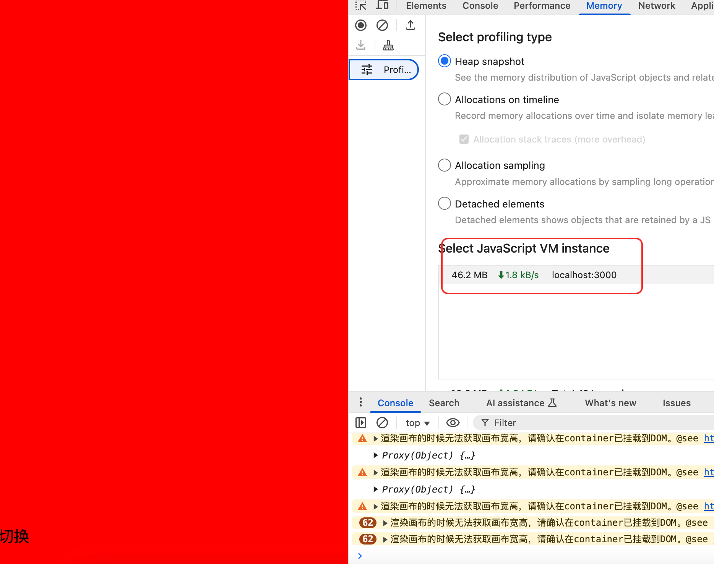

> https://github.com/didi/LogicFlow/issues/1581
> 
> 记录了解决这个问题的思路

## 问题表现

经过[pull#1993](https://github.com/didi/LogicFlow/pull/1993)和[pull#2004](https://github.com/didi/LogicFlow/pull/2004)改造，在这个[LogicFlow/vue3-memory-leak的demo](https://github.com/didi/LogicFlow/tree/master/examples/vue3-memory-leak)中仍然发生了内存泄露的情况，如下图所示

使用最新的代码，但是 Memory 仍然无法释放

## 解决思路

两个方向:
1. 上面的pr的修复是有效的，但是仍然没有修复干净
2. 上面的pr的修复是有效的，但是这个demo的一些代码还是造成了内存泄露的问题

-------

1. 我们按照上面pr修复思路再去检查demo的一些代码是否发生了内存泄露
2. 使用一些内存泄露的工具检测（比如[MemLab](https://github.com/facebook/memlab?spm=5aebb161.2ef5001f.0.0.3dff5171UJh1iK))

上面的pr主要包括几个方向：

## 问题排查1

# 参考
1. [如何查找和解决前端内存泄漏问题？ - 排查和分析技巧详解](https://juejin.cn/post/7232127712642547770)
2. [Memory Leaks in JavaScript: Understanding and Prevention](https://medium.com/@vikramkadu/memory-leaks-in-javascript-understanding-and-prevention-667835fcc650)
3. [Memory Leak Detection in Modern Frontend Apps](https://dev.to/shcheglov/graphql-non-standard-way-of-selecting-a-client-library-5bid)
4. [Memory management](https://developer.mozilla.org/en-US/docs/Web/JavaScript/Memory_management?spm=5aebb161.2ef5001f.0.0.3dff5171UJh1iK)

